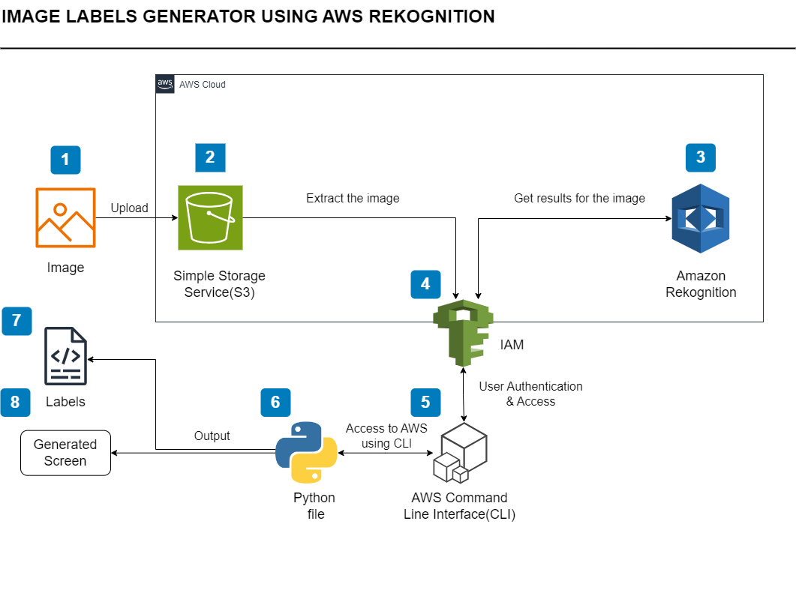

# AWS Image Label Generator

## Overview
This project utilizes **AWS Rekognition** to analyze images stored in an **S3 bucket** and generate labels with confidence levels. The pipeline is built using Python and AWS CLI.

## Features
- Upload an image to **Amazon S3**
- Analyze images using **AWS Rekognition**
- Extract labels and confidence scores
- Display the results as structured output with bounding boxes

## Architecture


## Prerequisites
Ensure you have the following installed:
- **Python 3.8+**
- **AWS CLI** (configured with IAM credentials)
- **Boto3** (AWS SDK for Python)
- **An AWS Account** with S3 and Rekognition permissions
- **Matplotlib** for visualization
- **PIL (Pillow)** for image handling

## Installing AWS Command Line Interface (CLI)
The AWS CLI is used to interact with various AWS services from the command line. To install AWS CLI:

### For Windows:
```sh
msiexec.exe /i https://awscli.amazonaws.com/AWSCLIV2.msi
```

### For macOS (using Homebrew):
```sh
brew install awscli
```

### For Linux (using package manager):
```sh
sudo apt-get install awscli
```

After installation, verify:
```sh
aws --version
```

Then, configure AWS CLI:
```sh
aws configure
```
Provide your **AWS Access Key**, **Secret Key**, **Region**, and **Output format**.

## Installation

### 1. Clone the repository:
```sh
 git clone https://github.com/yourusername/AWS-Image-Label-Generator.git
 cd AWS-Image-Label-Generator
```

### 2. Install dependencies:
```sh
pip install -r requirements.txt
```
or,
```sh
pip3 install -r requirements.txt
```

### 3. Open your preferred IDE (VSCode, etc.), and create a `.py` file.

## Usage

### Upload an Image to S3
```sh
aws s3 cp sample_image.jpg s3://your-bucket-name/
```

### Run the Image Label Detection
```sh
python detect_labels.py
```

### Sample Output
```
Detected labels for Hackathon.jpg:
Label: Cat
Confidence: 98.7%
Label: Animal
Confidence: 97.5%
Label: Pet
Confidence: 94.2%
Total labels detected: 3
```

### Bounding Boxes Output
The script also overlays bounding boxes on detected objects in the image using **Matplotlib** and **PIL**.

## File Structure
```
AWS-Image-Label-Generator/
│── detect_labels.py        
│── requirements.txt        
│── docs/
│   ├── architecture.png    
│   ├── usage.md            
│── .gitignore              
│── README.md               
│── LICENSE                 
```

## AWS Permissions Required
Your IAM user needs the following permissions:
```json
{
  "Version": "2012-10-17",
  "Statement": [
    {
      "Effect": "Allow",
      "Action": [
        "rekognition:DetectLabels",
        "s3:GetObject",
        "s3:ListBucket"
      ],
      "Resource": "*"
    }
  ]
}
```

## License
This project is licensed under the **MIT License**.

## Contributing
Feel free to fork this repository and contribute improvements!

